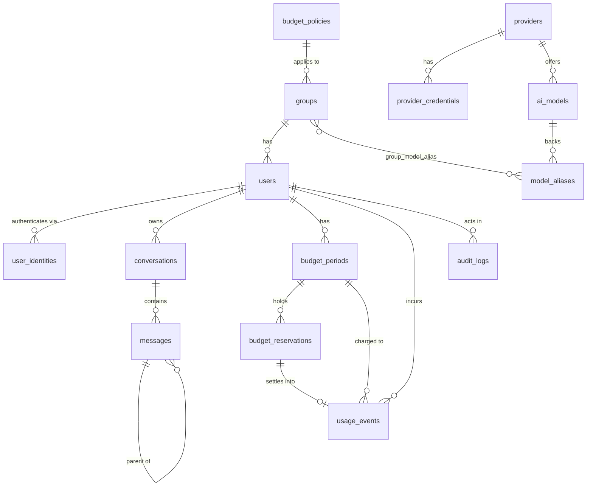

# Database Design

> Status: **Implemented through M5** (users, groups, identities, settings,
> audit log, providers/models/aliases, budget tables); conversations and
> messages follow in M6. Target engine: **MySQL 8.4 LTS**, InnoDB,
> character set `utf8mb4`.

## 1. Global conventions

| Topic | Decision | Rationale |
|---|---|---|
| Engine | InnoDB only | Row-level locking and transactions are required by the budget engine. |
| Charset / collation | `utf8mb4` / `utf8mb4_0900_ai_ci` as the database default | Language-neutral Unicode (UCA 9.0.0) collation suitable for an international open-source project; accent- and case-insensitive. It is **not** Turkish-specific (see §1.1). |
| Identifier collation | `utf8mb4_bin` for technical identifiers (`user_identities.subject`, `model_aliases.slug`, `ai_models.provider_model_id`, `providers.slug`) | `_ai_ci` is accent- *and* case-insensitive; two distinct technical IDs must never collide on a unique index. |
| Primary keys | `BIGINT UNSIGNED AUTO_INCREMENT` for internal tables; **UUIDv7** (`CHAR(36)`, Laravel `HasUuids`) for `conversations`, `messages`, `budget_reservations`, `usage_events` | UUIDs are used in URLs (no enumeration) and as idempotency keys. UUIDv7 is time-ordered, so it does not fragment the InnoDB clustered index. |
| Timestamps | `DATETIME` storing **UTC**, declared explicitly with `$table->dateTime('created_at')` etc. (never `timestamps()`/`softDeletes()`, which create `TIMESTAMP`); app and MySQL connection timezone are UTC | `TIMESTAMP` overflows in 2038. The institution timezone is applied only when computing budget period boundaries and when displaying dates. |
| Money | `DECIMAL(20,10)` USD | See §2. |
| Prices | `DECIMAL(14,6)` USD per **million** tokens | Provider list prices have at most a few decimals per million. |
| JSON | MySQL `JSON` type | Queried JSON fields get a generated column + index. |
| Soft deletes | Only where users expect "undo" semantics (`conversations`) | Financial and audit tables are never soft-deleted. |
| Enums | `VARCHAR(32)` + PHP backed enum + `CHECK (col IN (...))` | Native MySQL `ENUM` makes adding values a table rebuild. |
| Partial indexes | Not available in MySQL | Use composite indexes with the filter column first (e.g. `deleted_at`). |

### 1.1 Collation and Turkish text

- The default `utf8mb4_0900_ai_ci` compares and sorts by language-neutral
  Unicode rules. It is a good default for an international project but it is
  **not** a Turkish collation: being accent-insensitive, it treats letters
  that are distinct in the Turkish alphabet — such as `ş`/`s`, `ç`/`c`,
  `ö`/`o`, `ü`/`u`, `ğ`/`g` — as equal, and does not apply Turkish alphabet
  order or Turkish `I/ı`–`İ/i` case rules.
- MySQL's Turkish locale-specific collation is **`utf8mb4_tr_0900_ai_ci`**.
  Where Turkish alphabetical ordering matters (e.g. admin user lists sorted by
  name for a Turkish deployment), apply it at **query level** based on the
  active locale, e.g. `ORDER BY name COLLATE utf8mb4_tr_0900_ai_ci`. Column-level
  Turkish collation is not used by default because Ada is institution-neutral;
  an institution may change specific columns in a local migration if needed.
- Technical identifiers use **`utf8mb4_bin`** (binary, case-sensitive):
  `user_identities.subject`, `providers.slug`, `ai_models.provider_model_id`,
  `model_aliases.slug`. Two distinct identifiers must never collide on a
  unique index.
- E-mail addresses are lower-cased by the application before storage and
  compared exactly; the unique index on `users.email` still uses the default
  collation.

### 1.2 Migration example

```php
Schema::create('budget_periods', function (Blueprint $table) {
    $table->id();
    $table->foreignId('user_id')->constrained()->restrictOnDelete();
    $table->dateTime('period_start');          // UTC
    $table->dateTime('period_end');            // UTC, exclusive
    $table->decimal('limit_usd', 20, 10);
    $table->decimal('spent_usd', 20, 10)->default(0);
    $table->decimal('reserved_usd', 20, 10)->default(0);
    $table->dateTime('created_at')->nullable();
    $table->dateTime('updated_at')->nullable();

    $table->unique(['user_id', 'period_start']);
    $table->index('period_start');
});
```

## 2. Money and precision

Costs are tiny per token: $0.10 per million tokens is $0.0000001 per token.
A single request can cost $0.00002. Floating point would accumulate errors
across millions of events, so:

- **Database:** `DECIMAL(20,10)` — 10 integer digits (up to $9,999,999,999)
  and 10 fractional digits (sub-nano-dollar). MySQL `DECIMAL` arithmetic,
  `SUM()` included, is exact.
- **PHP:** floats are forbidden for money. PDO returns `DECIMAL` columns as
  strings; an Eloquent cast turns them into an immutable `Usd` value object
  wrapping `Brick\Math\BigDecimal` (package `brick/math`). All arithmetic
  (`plus`, `minus`, `multipliedBy`, comparisons) happens on `BigDecimal` with
  scale 10 and `RoundingMode::UP` for charges (never under-charge).
- **Display:** rounded to 2 decimals for users, 4 for admin reports, via
  `Intl.NumberFormat` on the client.
- **Currency:** USD everywhere; column suffix `_usd` keeps it explicit.
  Displaying a local currency is a future presentation-only feature.

## 3. Entity relationship overview



`usage_events.conversation_id` and `usage_events.message_id` are deliberately
**not** foreign keys (see §5.14).

## 4. Settings storage

### `settings`

Purpose: typed application settings, managed with `spatie/laravel-settings`.
Each settings class maps to a `group`:

| Settings class | Group | Properties |
|---|---|---|
| `InstitutionSettings` | `institution` | `name`, `short_name`, `logo_path`, `logo_dark_path`, `favicon_path`, `primary_color`, `domain`, `support_email`, `default_locale`, `timezone`, `privacy_url`, `terms_url` |
| `AuthSettings` | `auth` | `allowed_domains` (list), `auto_provision` (bool), `default_group_id` |
| `ChatSettings` | `chat` | `default_alias_id`, `conversation_retention_days` (nullable), `usage_retention_months` |
| `BudgetSettings` | `budget` | `default_policy_id`, `max_concurrent_streams_default` |

| Column | Type | Notes |
|---|---|---|
| id | BIGINT PK | |
| group | VARCHAR(64) | |
| name | VARCHAR(128) | |
| locked | BOOLEAN | spatie field |
| payload | JSON | value; encrypted properties stored as ciphertext |
| created_at, updated_at | DATETIME | |

Indexes: `UNIQUE(group, name)`.

This replaces a dedicated `institution_settings` table: one generic, typed,
cached mechanism for all singleton settings instead of one single-row table per
concern. Settings are cached and invalidated on save.

## 5. Tables

### 5.1 `users`

Purpose: people who can sign in.

| Column | Type | Null | Notes |
|---|---|---|---|
| id | BIGINT UNSIGNED PK | | |
| name | VARCHAR(255) | | from IdP |
| email | VARCHAR(255) | | lower-cased by the application |
| avatar_url | VARCHAR(2048) | yes | |
| role | VARCHAR(32) | | `super_admin` \| `admin` \| `user`; default `user` |
| group_id | BIGINT UNSIGNED | | exactly one group per user |
| monthly_limit_override_usd | DECIMAL(20,10) | yes | individual budget override |
| locale | VARCHAR(8) | yes | null → institution default |
| appearance | VARCHAR(8) | | `light` \| `dark` \| `system`, default `system` |
| status | VARCHAR(16) | | `active` \| `disabled` |
| disabled_at | DATETIME | yes | |
| last_login_at | DATETIME | yes | |
| last_active_at | DATETIME | yes | updated at most every few minutes |
| remember_token | VARCHAR(100) | yes | |
| created_at, updated_at | DATETIME | | |

- Indexes: `UNIQUE(email)`, `INDEX(group_id)`, `INDEX(status, last_active_at)`.
- FKs: `group_id → groups.id ON DELETE RESTRICT` (a group with members cannot be deleted).
- Constraints: `CHECK (role IN ('super_admin','admin','user'))`,
  `CHECK (status IN ('active','disabled'))`,
  `CHECK (monthly_limit_override_usd IS NULL OR monthly_limit_override_usd >= 0)`.

**Roles as a column, not tables.** The brief listed `roles / permissions`. With
three fixed roles and Laravel Gates/Policies mapping role → abilities in code,
separate tables (or `spatie/laravel-permission`) add migrations, caching and UI
for no V1 benefit. The role enum can later be migrated to a permissions package
if institutions need custom roles.

**One group per user** (decision confirmed). Multiple groups would force rules
for combining budgets, model permissions and rate limits.

### 5.2 `user_identities`

Purpose: links a user to one or more external identity providers. Enables
adding OIDC/Entra/SAML later and survives e-mail changes.

| Column | Type | Null | Notes |
|---|---|---|---|
| id | BIGINT PK | | |
| user_id | BIGINT UNSIGNED | | |
| provider | VARCHAR(32) | | `google`, later e.g. `oidc-<name>`, `saml-<name>` (URL-safe: `[a-z0-9-]+`) |
| subject | VARCHAR(255) `utf8mb4_bin` | | stable IdP subject (`sub`) |
| email | VARCHAR(255) | | email at last login |
| last_claims | JSON | yes | non-sensitive claims for troubleshooting (`hd`, `email_verified`) — never tokens |
| last_login_at | DATETIME | | |
| created_at, updated_at | DATETIME | | |

- Indexes: `UNIQUE(provider, subject)`, `INDEX(user_id)`.
- FKs: `user_id → users.id ON DELETE CASCADE`.

### 5.3 `groups`

Purpose: organisational policy unit (Standard Personnel, Academics, IT…).

| Column | Type | Null | Notes |
|---|---|---|---|
| id | BIGINT PK | | |
| name | VARCHAR(255) | | |
| description | TEXT | yes | |
| budget_policy_id | BIGINT UNSIGNED | | |
| requests_per_minute | SMALLINT UNSIGNED | | rate limit |
| max_concurrent_streams | TINYINT UNSIGNED | | default 2 |
| is_default | BOOLEAN | | exactly one default group (enforced in app + settings) |
| created_at, updated_at | DATETIME | | |

- Indexes: `UNIQUE(name)`, `INDEX(budget_policy_id)`.
- FKs: `budget_policy_id → budget_policies.id ON DELETE RESTRICT`.
- M2 creates the table with `name`, `description`, `is_default` and inserts
  the default group in the same migration; M5 adds `budget_policy_id`
  (existing groups get the Default policy), `requests_per_minute` (default
  20, enforced from M6/M7) and `max_concurrent_streams` (default 2).
- Seed: the migrations create the `Default` group and the `Default` policy
  (limit from `ADA_DEFAULT_MONTHLY_LIMIT_USD`, default `10`).

### 5.4 `group_model_alias`

Purpose: which model aliases a group may use.

| Column | Type | Notes |
|---|---|---|
| group_id | BIGINT UNSIGNED | |
| model_alias_id | BIGINT UNSIGNED | |
| created_at | DATETIME | |

- PK: `(group_id, model_alias_id)`; `INDEX(model_alias_id)`.
- FKs: both `ON DELETE CASCADE`.
- Created in M4 (schema only); managed from the group admin screens (M7).

### 5.5 `budget_policies`

Purpose: named, reusable monthly limits.

| Column | Type | Null | Notes |
|---|---|---|---|
| id | BIGINT PK | | |
| name | VARCHAR(255) | | e.g. "Standard", "Researcher" |
| monthly_limit_usd | DECIMAL(20,10) | | |
| created_at, updated_at | DATETIME | | |

- Indexes: `UNIQUE(name)`.
- Constraints: `CHECK (monthly_limit_usd >= 0)`.

The brief's `enabled` flag is dropped: a disabled policy has no clear meaning
("unlimited" would be dangerous, "blocked" is better expressed as a `$0`
policy or a disabled user). There is **no unlimited budget** in V1.

Effective limit for a user = `users.monthly_limit_override_usd`
?? `groups.budget_policy.monthly_limit_usd`.

### 5.6 `providers`

Purpose: configured AI provider accounts.

| Column | Type | Null | Notes |
|---|---|---|---|
| id | BIGINT PK | | |
| slug | VARCHAR(64) `utf8mb4_bin` | | e.g. `openai` |
| driver | VARCHAR(32) | | `openai` \| `anthropic` \| `gemini` (later `openai_compatible`, `azure_openai`, …) |
| name | VARCHAR(255) | | admin display |
| base_url | VARCHAR(2048) | yes | override for compatible endpoints |
| options | JSON | yes | driver options (organization id, API version…) — no secrets |
| enabled | BOOLEAN | | |
| created_at, updated_at | DATETIME | | |

- Indexes: `UNIQUE(slug)`.
- Constraints (M4): `CHECK (driver IN ('openai', 'anthropic', 'gemini'))`,
  widened when a driver is added. The driver cannot be changed after
  creation (admin validation).

### 5.7 `provider_credentials`

Purpose: encrypted API keys, separated from provider metadata so that
provider rows can be read (e.g. for model listings) without ever loading
secrets, and so key rotation leaves history.

| Column | Type | Null | Notes |
|---|---|---|---|
| id | BIGINT PK | | |
| provider_id | BIGINT UNSIGNED | | |
| secret | TEXT | | Laravel `encrypted` cast (AES-256, `APP_KEY`) |
| last_four | CHAR(4) | | for masked display `••••8f2a` |
| is_active | BOOLEAN | | one active credential per provider |
| created_by | BIGINT UNSIGNED | yes | |
| rotated_at | DATETIME | yes | when superseded |
| created_at, updated_at | DATETIME | | |

- Indexes: `INDEX(provider_id, is_active)`.
- FKs: `provider_id → providers.id ON DELETE CASCADE`,
  `created_by → users.id ON DELETE SET NULL`.
- If no active DB credential exists, the adapter falls back to `.env`
  (`OPENAI_API_KEY`, …). The model's `$hidden` includes `secret`.
- Rotation (`CredentialVault`) inserts a new active row and deactivates the
  previous one (`is_active = false`, `rotated_at` set); history is kept.

### 5.8 `ai_models`

Purpose: the registry of concrete provider models and their pricing and
capabilities. Admin-facing only.

| Column | Type | Null | Notes |
|---|---|---|---|
| id | BIGINT PK | | |
| provider_id | BIGINT UNSIGNED | | |
| provider_model_id | VARCHAR(255) `utf8mb4_bin` | | exact ID sent to the provider |
| display_name | VARCHAR(255) | | e.g. "Claude Sonnet" (admin/tooltip) |
| description | TEXT | yes | |
| input_price_per_million | DECIMAL(14,6) | | |
| output_price_per_million | DECIMAL(14,6) | | reasoning tokens are billed as output |
| cached_input_price_per_million | DECIMAL(14,6) | yes | cache reads; null → input price |
| cache_write_price_per_million | DECIMAL(14,6) | yes | cache writes (Anthropic); null → input price |
| context_window | INT UNSIGNED | | tokens |
| max_output_tokens | INT UNSIGNED | | provider maximum |
| supports_vision | BOOLEAN | | |
| supports_files | BOOLEAN | | |
| supports_tools | BOOLEAN | | |
| supports_reasoning | BOOLEAN | | |
| enabled | BOOLEAN | | |
| metadata | JSON | yes | e.g. pricing tiers, deprecation date |
| created_at, updated_at | DATETIME | | |

- Indexes: `UNIQUE(provider_id, provider_model_id)`, `INDEX(enabled)`.
- FKs: `provider_id → providers.id ON DELETE RESTRICT`.
- Constraints: all prices `>= 0`, `context_window > 0`, `max_output_tokens > 0`
  (one `CHECK`). Prices are cast `decimal:6` (strings, never floats); the
  admin form validates at most six decimals and `max_output_tokens ≤
  context_window`.
- Tiered pricing (e.g. higher price above 200k input tokens) is stored in
  `metadata.pricing_tiers`; V1 reservation uses the **highest** tier price
  (conservative) and settlement uses the tier that applies.

### 5.9 `model_aliases`

Purpose: the **only** model entity users see ("Fast", "Advanced", "Claude").
Swapping the backing model does not change user experience or permissions.

| Column | Type | Null | Notes |
|---|---|---|---|
| id | BIGINT PK | | |
| slug | VARCHAR(64) `utf8mb4_bin` | | stable key, e.g. `advanced` |
| name | JSON | | `{"tr": "Gelişmiş", "en": "Advanced"}` |
| description | JSON | yes | localized secondary text |
| ai_model_id | BIGINT UNSIGNED | | backing model |
| max_output_tokens | INT UNSIGNED | yes | per-alias cap (≤ model max) |
| temperature | DECIMAL(3,2) | yes | optional default |
| system_prompt | TEXT | yes | optional institution-defined instructions |
| show_model_details | BOOLEAN | | show "Claude Sonnet · Anthropic" as secondary info |
| sort_order | SMALLINT | | |
| enabled | BOOLEAN | | |
| created_at, updated_at | DATETIME | | |

- Indexes: `UNIQUE(slug)`, `INDEX(enabled, sort_order)`, `INDEX(ai_model_id)`.
- FKs: `ai_model_id → ai_models.id ON DELETE RESTRICT` (the FK index serves
  `INDEX(ai_model_id)`).
- `max_output_tokens ≤ ai_models.max_output_tokens` is enforced by admin
  validation; null means "use the model maximum". Every locale in
  `ada.locales.available` needs a `name`.

### 5.10 `budget_periods` (replaces `monthly_budgets`)

Purpose: a user's spending envelope for one period. Generic
`period_start`/`period_end` (half-open `[start, end)`) instead of year/month
columns, so other period lengths are possible later without a schema change.

| Column | Type | Null | Notes |
|---|---|---|---|
| id | BIGINT PK | | |
| user_id | BIGINT UNSIGNED | | |
| period_start | DATETIME (UTC) | | e.g. 2026-09-30 21:00:00 for Oct 1 00:00 Europe/Istanbul |
| period_end | DATETIME (UTC) | | exclusive |
| limit_usd | DECIMAL(20,10) | | snapshot of the effective limit |
| spent_usd | DECIMAL(20,10) | | denormalized sum of settled usage |
| reserved_usd | DECIMAL(20,10) | | sum of active reservations |
| created_at, updated_at | DATETIME | | |

- Indexes: `UNIQUE(user_id, period_start)` (also the lock target),
  `INDEX(period_start)` (reports).
- FKs: `user_id → users.id ON DELETE RESTRICT`.
- Constraints: `CHECK (spent_usd >= 0)`, `CHECK (reserved_usd >= 0)`,
  `CHECK (limit_usd >= 0)`, `CHECK (period_end > period_start)`.
- Rows are created lazily on the first request of a period — see
  [budget-engine.md](budget-engine.md).

`spent_usd` is expected never to exceed `limit_usd` (input is counted by the
provider's own counter plus a safety margin; output is capped). There is
nevertheless intentionally **no** `CHECK (spent_usd <= limit_usd)`: actual
provider usage must always be recorded in full, even in the rare case the
provider bills more than it counted. Such cases are flagged as overshoots
(see [budget-engine.md](budget-engine.md)).

### 5.11 `budget_reservations`

Purpose: money held for in-flight requests; state machine
`active → settled | released | expired`.

| Column | Type | Null | Notes |
|---|---|---|---|
| id | CHAR(36) UUIDv7 PK | | also the idempotency key |
| budget_period_id | BIGINT UNSIGNED | | |
| user_id | BIGINT UNSIGNED | | denormalized for queries |
| ai_model_id | BIGINT UNSIGNED | | |
| amount_usd | DECIMAL(20,10) | | reserved amount |
| settled_amount_usd | DECIMAL(20,10) | yes | actual cost when settled |
| input_tokens | INT UNSIGNED | | input tokens used for the reservation |
| input_count_method | VARCHAR(24) | | `provider_endpoint` \| `local_tokenizer` \| `estimated` |
| input_safety_margin | DECIMAL(5,4) | | margin ratio applied, e.g. `0.0500` |
| max_output_tokens | INT UNSIGNED | | cap actually sent to the provider |
| status | VARCHAR(16) | | `active` \| `settled` \| `released` \| `expired` |
| status_reason | VARCHAR(64) | yes | `provider_error`, `client_abort`, `timeout`, … |
| expires_at | DATETIME | | TTL for stale cleanup |
| settled_at | DATETIME | yes | |
| created_at, updated_at | DATETIME | | |

- Indexes: `INDEX(status, expires_at)` (cleanup), `INDEX(user_id, status)`
  (concurrent stream limit), `INDEX(budget_period_id)`.
- FKs: `budget_period_id → budget_periods.id ON DELETE RESTRICT`,
  `user_id → users.id ON DELETE RESTRICT`,
  `ai_model_id → ai_models.id ON DELETE RESTRICT`.
- Constraints: `CHECK (amount_usd >= 0)`, status `CHECK`.

### 5.12 `conversations`

| Column | Type | Null | Notes |
|---|---|---|---|
| id | CHAR(36) UUIDv7 PK | | used in URLs |
| user_id | BIGINT UNSIGNED | | owner |
| title | VARCHAR(255) | yes | V1: derived from the first message (no AI call) |
| model_alias_id | BIGINT UNSIGNED | yes | last used / default alias |
| last_message_at | DATETIME | | sidebar ordering |
| created_at, updated_at | DATETIME | | |
| deleted_at | DATETIME | yes | soft delete |

- Indexes: `INDEX(user_id, deleted_at, last_message_at)` (sidebar list; MySQL
  has no partial index), `INDEX(deleted_at)` (retention pruning).
- FKs: `user_id → users.id ON DELETE CASCADE`,
  `model_alias_id → model_aliases.id ON DELETE SET NULL`.

### 5.13 `messages`

| Column | Type | Null | Notes |
|---|---|---|---|
| id | CHAR(36) UUIDv7 PK | | |
| conversation_id | CHAR(36) | | |
| parent_message_id | CHAR(36) | yes | tree for regenerate/branching |
| role | VARCHAR(16) | | `user` \| `assistant` \| `system` |
| content | MEDIUMTEXT | | Markdown/plain text |
| status | VARCHAR(16) | | `completed` \| `streaming` \| `failed` \| `cancelled` |
| error_code | VARCHAR(64) | yes | stable, translatable |
| finish_reason | VARCHAR(32) | yes | `stop`, `length`, `content_filter`, `cancelled` |
| model_alias_id | BIGINT UNSIGNED | yes | alias chosen by the user |
| ai_model_id | BIGINT UNSIGNED | yes | concrete model actually used |
| metadata | JSON | yes | future: attachments, tool calls, citations |
| created_at, updated_at | DATETIME | | |

- Indexes: `INDEX(conversation_id, created_at)`, `INDEX(parent_message_id)`,
  `INDEX(status, updated_at)` (stale streaming cleanup).
- FKs: `conversation_id → conversations.id ON DELETE CASCADE`,
  `parent_message_id → messages.id ON DELETE CASCADE`,
  `model_alias_id → model_aliases.id ON DELETE SET NULL`,
  `ai_model_id → ai_models.id ON DELETE SET NULL`.

Changes from the brief: `provider_id` is dropped (derivable from
`ai_model_id`); **`usage_event_id` is dropped** — the usage ledger references
messages, not the other way round, so pruning conversation content never has
to touch financial records. Multimodal content will use a
`message_attachments` table rather than changing `content`.

### 5.14 `usage_events` (append-only ledger)

Purpose: immutable financial record of every charge.

| Column | Type | Null | Notes |
|---|---|---|---|
| id | CHAR(36) UUIDv7 PK | | |
| type | VARCHAR(16) | | `charge` \| `adjustment` |
| user_id | BIGINT UNSIGNED | | |
| group_id | BIGINT UNSIGNED | | group **at the time** of usage (reports by group stay correct after moves) |
| budget_period_id | BIGINT UNSIGNED | | |
| reservation_id | CHAR(36) | yes | null for adjustments |
| conversation_id | CHAR(36) | yes | **no FK** (loose reference) |
| message_id | CHAR(36) | yes | **no FK** (loose reference) |
| provider_id | BIGINT UNSIGNED | yes | |
| ai_model_id | BIGINT UNSIGNED | yes | |
| model_alias_id | BIGINT UNSIGNED | yes | |
| source | VARCHAR(16) | | `chat`, `admin` (adjustments); later `api` |
| input_tokens | INT UNSIGNED | | non-cached input |
| cached_input_tokens | INT UNSIGNED | | cache reads |
| cache_write_tokens | INT UNSIGNED | | cache writes |
| output_tokens | INT UNSIGNED | | visible output |
| reasoning_tokens | INT UNSIGNED | | billed as output |
| input_price_snapshot | DECIMAL(14,6) | | per million, at the time of usage |
| cached_input_price_snapshot | DECIMAL(14,6) | | |
| cache_write_price_snapshot | DECIMAL(14,6) | | |
| output_price_snapshot | DECIMAL(14,6) | | |
| input_cost_usd | DECIMAL(20,10) | | input + cached + cache write |
| output_cost_usd | DECIMAL(20,10) | | output + reasoning |
| other_cost_usd | DECIMAL(20,10) | | future (per-request fees, tools) |
| total_cost_usd | DECIMAL(20,10) | | may be negative only for `adjustment` |
| is_estimated | BOOLEAN | | usage estimated (stream aborted without provider usage) |
| input_count_method | VARCHAR(24) | | copied from the reservation (monitoring) |
| reserved_input_tokens | INT UNSIGNED | yes | counted input at reservation time; compared with billed input to monitor counter deviation |
| provider_request_id | VARCHAR(255) | yes | provider's request id for support |
| status | VARCHAR(16) | | `completed` \| `partial` \| `failed` |
| reason | VARCHAR(255) | yes | for adjustments (who/why) |
| created_by | BIGINT UNSIGNED | yes | for adjustments |
| created_at | DATETIME | | no `updated_at` |

- Indexes: `UNIQUE(reservation_id)` (idempotent settlement),
  `INDEX(user_id, created_at)`, `INDEX(group_id, created_at)`,
  `INDEX(ai_model_id, created_at)`, `INDEX(provider_id, created_at)`,
  `INDEX(budget_period_id)`, `INDEX(created_at)`.
- FKs: `user_id`, `group_id`, `budget_period_id` → `ON DELETE RESTRICT`;
  `provider_id`, `ai_model_id`, `model_alias_id` → `ON DELETE RESTRICT`.
  `conversation_id` and `message_id` have **no FK**, so conversation retention
  and user deletion of chats never cascade into the ledger.
- Constraints: token counts `>= 0` (unsigned); one `CHECK`: `type` and
  `status` values, all costs `>= 0` unless `type = 'adjustment'`, and
  adjustments require a `reason`.
- The `budget_period_id` FK index serves `INDEX(budget_period_id)`.

**Append-only enforcement**

1. *Application layer (mandatory):* the `UsageEvent` model throws on
   `updating` and `deleting`; there is no update code path. Corrections are
   new `adjustment` rows (can be negative) with `reason` and `created_by`,
   and they update `budget_periods.spent_usd` inside the same transaction.
2. *Database layer (recommended, optional):* a `BEFORE UPDATE` trigger
   `SIGNAL SQLSTATE '45000'`; a `BEFORE DELETE` trigger that allows deletion
   only when the session variable `@ada_allow_prune = 1` (set by the retention
   command). Creating triggers on servers with binary logging requires
   `log_bin_trust_function_creators=1` or the `SUPER`/`TRIGGER` privilege,
   so the trigger migration is optional and documented.

### 5.15 `audit_logs` (append-only)

| Column | Type | Null | Notes |
|---|---|---|---|
| id | BIGINT PK | | |
| actor_id | BIGINT UNSIGNED | yes | null for system/CLI |
| actor_type | VARCHAR(16) | | `user` \| `system` \| `cli` |
| action | VARCHAR(64) | | e.g. `user.role_changed`, `provider.credential_rotated` |
| subject_type | VARCHAR(64) | yes | |
| subject_id | VARCHAR(64) | yes | |
| old_values | JSON | yes | **redacted** |
| new_values | JSON | yes | **redacted** |
| ip_address | VARCHAR(45) | yes | |
| user_agent | VARCHAR(512) | yes | |
| created_at | DATETIME | | |

- Indexes: `INDEX(created_at)`, `INDEX(actor_id, created_at)`,
  `INDEX(subject_type, subject_id)`, `INDEX(action, created_at)`.
- FKs: `actor_id → users.id ON DELETE SET NULL`.
- Same append-only enforcement as `usage_events`. Secrets are never written —
  see [security.md](security.md).

### 5.16 Laravel framework tables

`sessions` (when `SESSION_DRIVER=database`), `cache`, `cache_locks`, `jobs`,
`job_batches`, `failed_jobs`, `password_reset_tokens` (unused, no password
login), `migrations`.

## 6. Pricing: snapshots vs. versioned price table

| | Snapshot on usage event (**chosen**) | Versioned `model_prices` table |
|---|---|---|
| Historical cost stability | Guaranteed: cost and prices stored on the row | Guaranteed if effective ranges never overlap and are never edited |
| Report queries | No joins | Join by time range |
| Complexity | Low | Effective-from/to management, overlap validation, admin UI |
| Audit of price changes | `audit_logs` records old/new prices | Implicit in table |
| Storage | ~4 extra decimals per event | Small table |

We store **both** the price snapshots and the computed costs on each
`usage_event`. The current price lives on `ai_models`; every price change is
audit-logged. A versioned table can be added later without migrating events.

## 7. Retention readiness

- Conversation content (`conversations`, `messages`) can be pruned by age
  (`ChatSettings.conversation_retention_days`) without touching
  `usage_events` (no FKs) or `budget_periods`.
- The usage ledger is pruned separately
  (`ChatSettings.usage_retention_months`, e.g. 24) by `ada:retention:prune`,
  which sets `@ada_allow_prune`.
- User offboarding: users are **disabled**, not deleted. Hard deletion (e.g.
  a data-subject request) deletes conversations and identities and
  pseudonymizes ledger rows via an explicit, audited command.

## 8. Growth estimate

1,500 active users × 20 requests/day ≈ 30k `usage_events`/day ≈ 11M/year. With
the indexes above, monthly reports over raw events are fine at this scale. If
reports slow down, add a `usage_daily_aggregates` table maintained by the
scheduler (M9 decision point).
